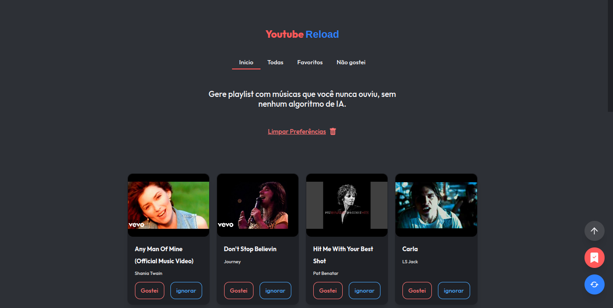
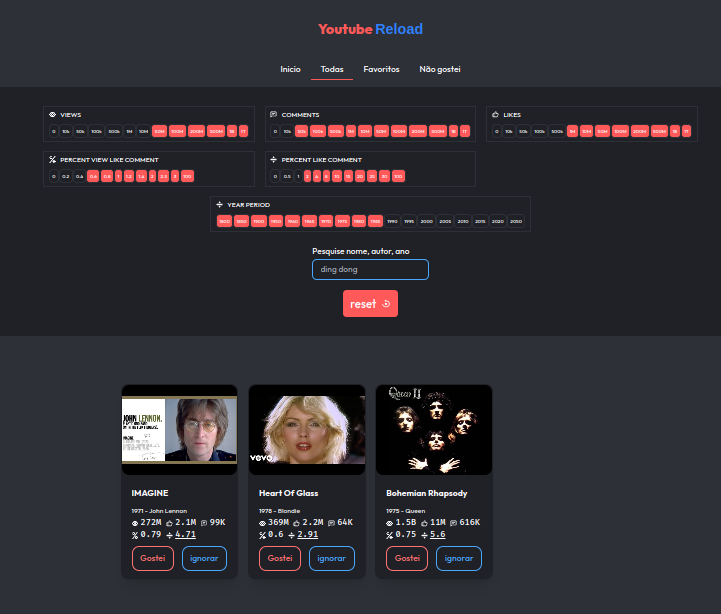
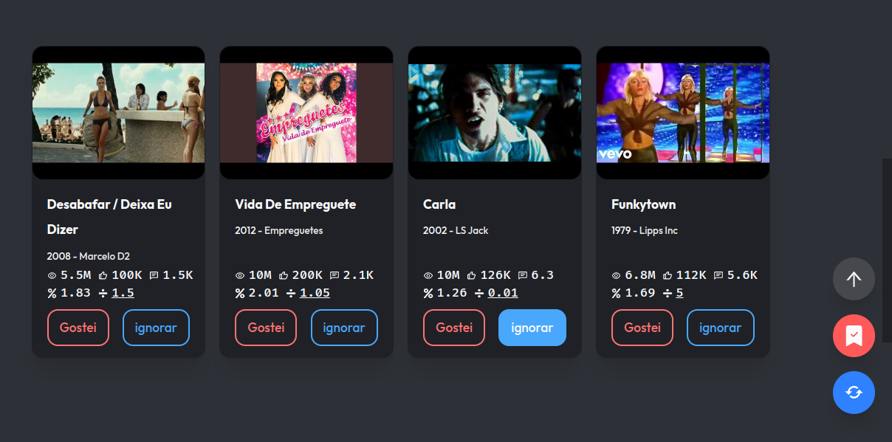

<div align="center">
  
  
  
  
</div>

<h3 align="center">Youtube Reload</h3>
<p align="center">
  Gere playlists com músicas que você nunca ouviu.
  <br>
  <a href="https://gabrielogregorio.github.io/youtube-reload/"><strong>Ver demonstrativo »</strong></a>
  <br>
  <br>
</p>

<h3>Informações gerais</h3>

Um dos meus primeiros projetos usando VueJs, estou migrando para o github pages


### Como Iniciar           
Use os comandos abaixo

```bash    
npm install
npm run serve
```

Acesse http://localhost:8080/

### Capturas de tela



